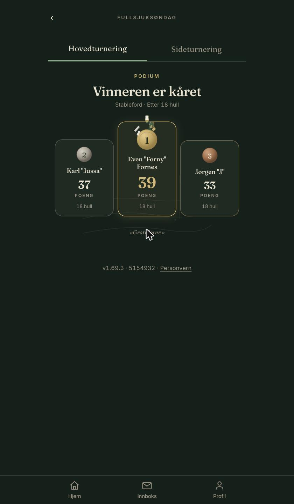
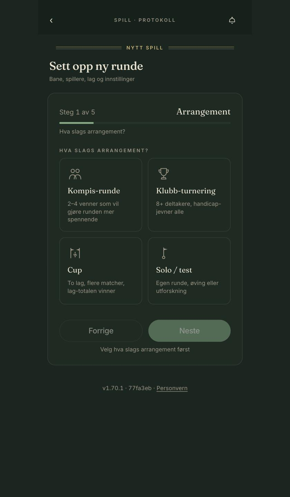
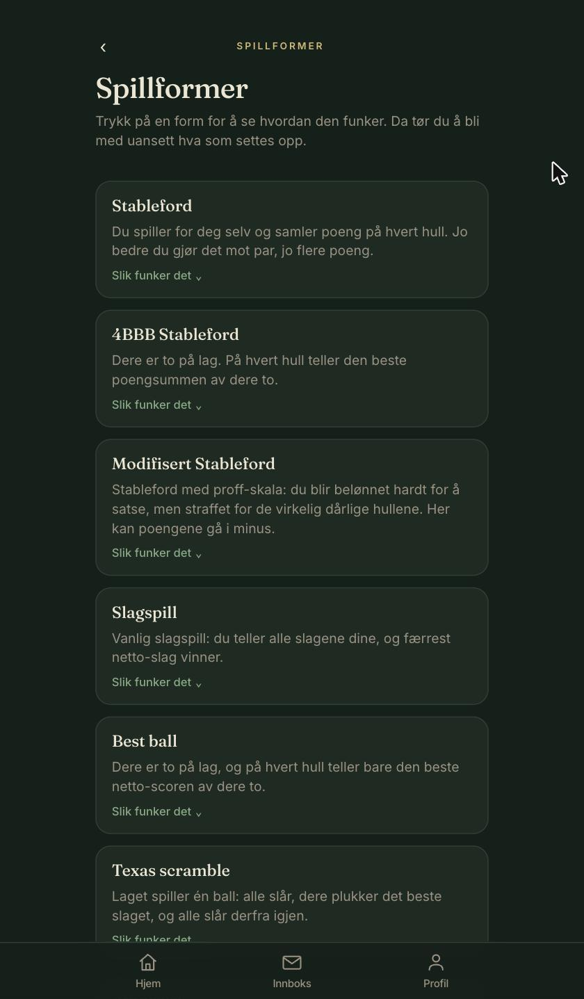
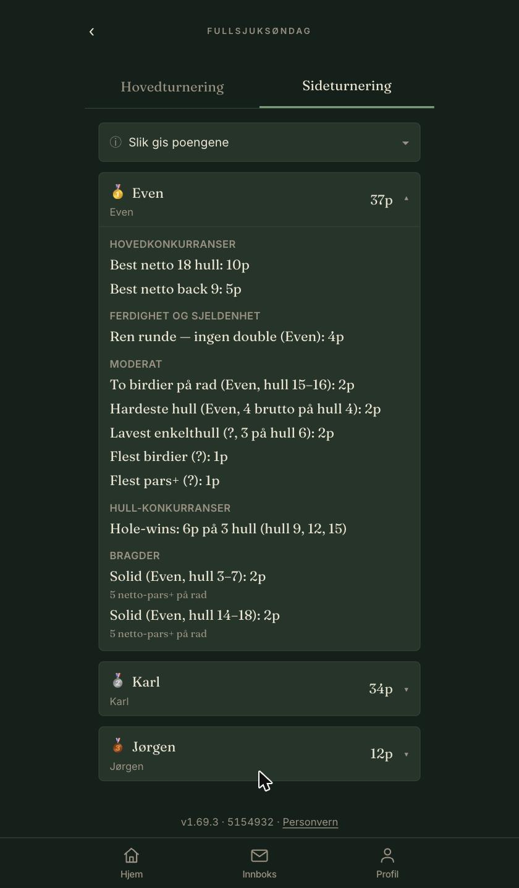

# Tørny

> Fire up a golf tournament in a couple of minutes.

<p align="center">
  
  
  
  
</p>

Tørny is a mobile-first PWA for running golf tournaments. It scales from four friends on a Saturday round to a club event with 150 players. You create the game, invite the group, and everyone taps their strokes while they walk the course. The app handles the rest: scoring, the live leaderboard, side tournaments, and the mail that goes out when a game ends.

Live at [tornygolf.no](https://tornygolf.no) (also `tørny.no`).

It's invite-only: players sign in with a one-time code by mail, with no open signup and no password to forget. Any signed-in player can set up a game, run it, and finish it themselves, and manage their own games end to end: edit or delete before play starts, add or remove players, invite new people by mail, withdraw someone mid-round, and approve a scorecard on the flight's behalf when a co-player can't. Everyone gets a Klubbhuset tab at the bottom of the screen: your own games gather there, and it's where you set up a new game or add a course. For admins it also holds the full secretariat, where they run club-scale tournaments. Tørny is a solo project, built and run by Jørgen, and it runs in production for real tournaments.

## What you get

- More than twenty tournament formats, all on WHS net handicap.
- A leaderboard that updates live while your flight taps scores.
- Offline-first scoring. Tap in a dead spot on the course and it syncs once your phone has signal again.
- A side tournament you can bolt onto any game: a points race across the round, plus longest-drive and closest-to-pin contests.
- Clubs, set up through Tørny. A club gathers people and tournaments in one named place; you arrange one with us rather than spinning it up yourself, and each comes with a member cap and a duration. The owner runs it from there: appoint co-admins and owners, add members by mail or a shared join link, approve join requests, and set up rounds every member finds under "Finn turneringer" and joins straight away, even when the round would otherwise be private.
- Friends. Add people you've played with, by mail, or with a share link that connects whoever opens it. Friends turn up when you fill a team, and their games appear under "Finn turneringer" in their own section. Open a round "for friends": tick a box on a request-to-join game and your friends skip the approval and join straight away, while everyone else still asks.
- An inbox for invitations, friend requests, peer approvals, submitted scorecards, finished games, and requests to join your club. Mail only goes out when you're not already in the app.
- Installable on your home screen. It opens like a native app, with no browser bar on top.
- GDPR self-service. Export or delete your data from your profile page without emailing anyone.

## Formats

Tørny ships more than twenty scoring modes. Each one comes with a short rules card in the app, so a player can pick something they've never tried and still know how to score it.

- Solo: stroke play, Stableford, modified Stableford
- Matchplay: singles, fourball, foursomes, greensome, gruesome, Chapman, patsome, round robin
- Team: best ball, Texas and Florida scramble, Ambrose, shamble
- Betting games: Wolf, Nassau, Skins, Bingo Bango Bongo, Nines, Acey Deucey

## Side tournaments

Any game can carry a side tournament next to the main result. Turn it on and it runs as an automatic points race across the round, and you can switch off any category you don't care about.

The package counts things like the best net front and back nine, King of the par 3s, 4s and 5s, and most birdies and eagles. It also hands out named badges: Turkey for three birdies in a row, Solid for five, and Snowman for a blow-up hole (that last one costs you points).

Then there are the two hole contests, longest drive and closest to the pin, with up to two of each. Those winners can't be read off the scorecard, so you pick them yourself when you end the game.

## Stack

| | |
|---|---|
| Framework | Next.js 16 (App Router) + React 19 + TypeScript |
| Styling | Tailwind v4, forest-and-champagne palette |
| Database and auth | Supabase (Postgres + Auth + Realtime, EU region) |
| Offline sync | Dexie (IndexedDB) with a last-write-wins RPC |
| Mail | Resend, through the verified `tornygolf.no` domain |
| Testing | Vitest + Testing Library + Playwright |
| Hosting | Vercel, auto-deploy on push to `main` |

Auth uses a one-time code by mail. Magic links went in the bin because iOS PWA handoff and mail scanners each broke the flow in their own way at the same time.

## Running it locally

```bash
npm install
npm run dev
```

Open [http://localhost:3000](http://localhost:3000). You'll need a `.env.local` with Supabase and Resend keys. They're not in the repo, so a fresh clone won't boot on its own. This isn't wired up for outside contributors.

```bash
npm test          # vitest (2000+ unit + integration)
npm run e2e       # playwright
npm run lint
npm run build
```

## How it fits together

The scoring logic ([`lib/scoring/`](lib/scoring/)) is plain TypeScript with no Supabase dependency. It has its own tests and its own TDD discipline, so don't touch it without writing a new test first. This is where the WHS formula, stroke allocation, best-ball aggregation, the five-tier tiebreaker, and all twenty-odd game modes live.

Offline sync ([`lib/sync/`](lib/sync/)) writes to Dexie first and drains the queue against Supabase once the phone has signal again. Last write wins, keyed on `client_updated_at`. The Dexie database is named `'golf-app'` for historical reasons. Don't rename it, or you'll wipe local data for every existing user.

RLS is enforced strictly in Postgres. You see your own scores, same-flight scores during an active game, and every score once the admin has ended the game. Realtime needs an explicit `supabase.realtime.setAuth()`; auto-propagation doesn't work for the WebSocket channel, which is a known quirk.

Migrations live in [`supabase/migrations/`](supabase/migrations/) (70+ files, chronological).

## Where the rest lives

- [CLAUDE.md](CLAUDE.md) is the main reference: working model, conventions, brand voice, and the files worth knowing.
- [AGENTS.md](AGENTS.md) is short but it matters. Next.js 16 has breaking changes against what you think you know.
- [CHANGELOG.md](CHANGELOG.md) is the version history, with plain-language taglines and the technical detail collapsed underneath.
- [GitHub Issues](https://github.com/jdlarssen/golf-app/issues) is the whole work queue, tagged by type, area, and scope.
- [`docs/`](docs/) holds the launch checklist, mail templates, and the original design notes.
