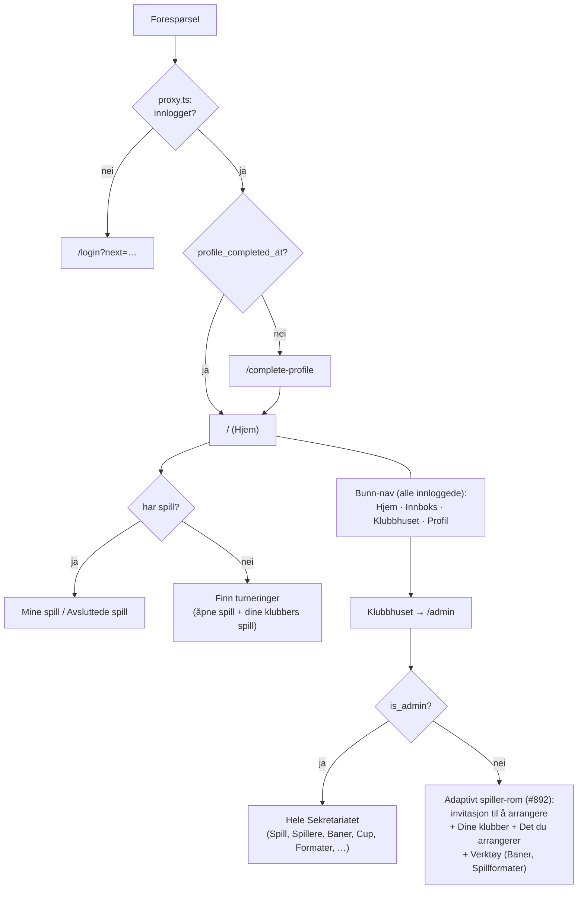
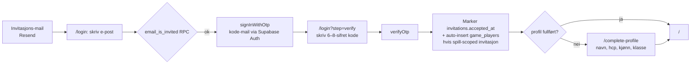
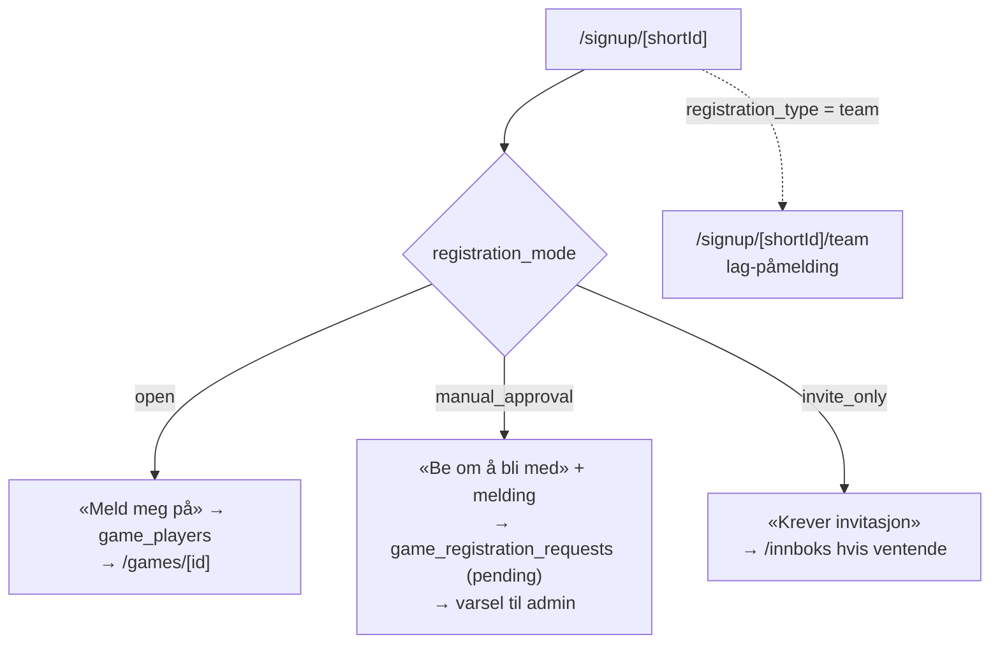
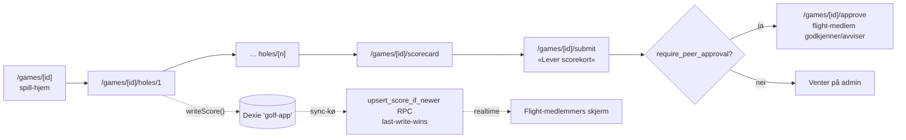
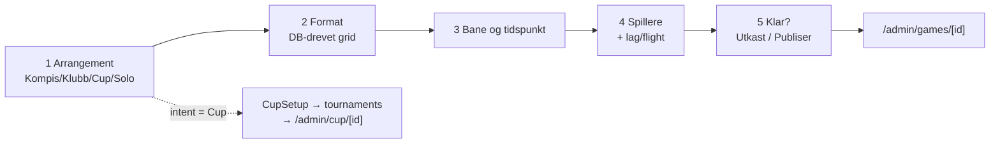
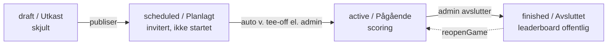

<!--
  Brukerflyt-kart for Tørny. Levende dokument — brukes til å vurdere brukervennlighet.
  Kartlagt 2026-05-31 via fem parallelle kode-utforskninger (auth, gameplay, admin,
  wizard, navigasjon). Alle ruter/actions verifisert mot faktisk kode.
-->

# Tørny — brukerflyt-kart

Mobil-først PWA. To personas: **Admin/arrangør** (`is_admin`) og **Spiller** (invitert).

Diagrammene under er Mermaid (renderes på GitHub / i preview). Lenger ned:
teknisk-kobling per steg, og en prioritert brukervennlighets-vurdering.

---

## 0. Inngang & routing

`proxy.ts` gater alt unntatt `/login`, `/legal/*`, `/signup/*`, og PWA-assets.
Uinnlogget → `/login?next=<path>`. Innlogget uten fullført profil → `/complete-profile`.

**Persistente nav-elementer** (verifisert i `app/layout.tsx` + sidene):
`BrandMark` (logo, ikke klikkbar) · `InstallBanner` (PWA) · `ProductUpdateBanner` ·
`TopBar` (tilbake-pil + tittel, på indre sider) · `AppVersionFooter` (versjon + Personvern).

**Vedvarende bunn-nav** (#355, #392): fire faste faner — Hjem, Innboks, Klubbhuset, Profil —
rendret globalt i `app/layout.tsx`, synlig for alle innloggede på alle flater (også i Klubbhus-
rommet `/admin`). Skjult kun på hull-skjerm, login og onboarding. «Klubbhuset» er universell:
fanen gates ikke på rolle, men flatene inne gates — admin ser hele Sekretariatet, mens spilleren
møter et **adaptivt rom** (#892): en invitasjon til å arrangere (aldri en blindvei), klubbene sine,
spillene/cupene de selv har satt opp, og Verktøy (Baner + Spillformater) nederst. **Opprett
spill/bane bor inne i Klubbhuset, ikke på Hjem.** Hjem er play + discover-navet: dine spill +
«Finn turneringer».

**Klubber** (#442 + #50, milepæl Klubb-skala): en klubb er en navngitt, styrt container folk og
turneringer kan høre til. **Opprettelse er admin-gated** (#50): vanlige brukere oppretter ikke
klubber — `/klubber` viser en kontakt-vei (klubb@tornygolf.no), og hoved-admin oppretter klubben fra
Sekretariatet (`/admin/klubber/ny`, `admin_create_club`-RPC), velger eier (som blir **eneeier**) og
setter avtale-rammer: et **medlemstak** (`member_cap`) og en **varighet** (`valid_until` — uendelig
eller en sluttdato, redigerbar i `/admin/klubber/[id]`). Klubbene dine bor under Klubbhuset
(`/klubber`); klubb-siden (`/klubber/[id]`) viser medlemmer, lar eier/admin legge til på e-post eller
dele en bli-med-lenke (`/klubber/bli-med/[shortId]` → forespørsel → eier godkjenner), og har en «Sett
opp en runde for klubben»-dør. **Eieren delegerer** (#50): via `/klubber/[id]/rolle/[userId]` gjør
eieren medlemmer til admin eller eier (flere likestilte), eller setter dem ned (`set_club_member_role`
— siste eier kan ikke degraderes; den berørte varsles). Når et spill opprettes for en klubb (valgfritt
steg i veiviseren, `games.group_id`), ser **alle klubbens medlemmer** runden i «Finn turneringer» og
melder seg på direkte, uansett påmeldingsmåte, også `invite_only`. Medlemskap ER invitasjonen.
**Medlemstak + utløp håndheves** (#50): en full klubb tar ikke imot flere medlemmer; når `valid_until`
passeres fryses klubben (borte fra discovery, ingen nye medlemmer/spill, «utløpt»-banner), men pågående
runder spilles ferdig og en eier kan fornye via admin. Klubb ≠ venner: venner er en egen, flat relasjon.

**Venner** (#369, milepæl Klubb-skala): en flat, gjensidig bruker↔bruker-relasjon — ingen eier, ingen
admin, ingen identitet (≠ klubb). Du legger til venner på `/profile/venner` på tre måter: folk du har spilt
med (forslag), e-post (ukjent adresse → tilbud om å invitere på samme e-post), eller en delbar lenke
(`/venner/legg-til/[friend_code]`) som kobler den som åpner den direkte. Vennskap er gjensidig (forespørsel
→ mottaker godtar i Innboks); `friend_request`/`friend_accepted`-varsler dyplenker til vennelista. Venner
blir søkbare i lag-påmelding (`getTeamCandidates` = venner ∪ co-players, #408) og synlige i en egen «Fra
vennene dine»-seksjon i «Finn turneringer» — venners `open`/`manual_approval`-spill, aldri `invite_only`.
**Åpen for venner:** på et `manual_approval`-spill kan arrangøren huke av «Slipp venner direkte inn»
(`games.let_friends_skip_gate`), og da melder venner seg på direkte forbi godkjennings-gaten mens
ikke-venner fortsatt ber om plass.

---

## 1. SPILLER-flyter

### P1 — Bli med (invitasjon → innlogging → profil)

| Steg | Rute / fil | Teknisk |
|---|---|---|
| Be om kode | `app/(auth)/login/page.tsx`, `actions.ts` → `sendCode` | `email_is_invited` RPC gater `shouldCreateUser`; `signInWithOtp`. Kode-mail via **Supabase Auth**. Honeypot-felt `website`. |
| Verifiser | `verifyCode` | `verifyOtp({type:'email'})`. Marker `invitations.accepted_at` (RLS 0012). Spill-scoped invitasjon → auto-insert i `game_players` + `notifyInvitedToGame`. |
| Fullfør profil | `app/complete-profile/page.tsx`, `actions.ts` | Setter `users.profile_completed_at` + navn/nickname/`hcp_index`/gender/level. |

**To mailer per invitasjon:** Resend-notifikasjon (`lib/mail/inviteNotification.ts`) når noen inviterer, så kode-mail når invitéen ber om kode på `/login`.

### P2 — Selv-påmelding (offentlig lenke)

`/signup/[shortId]` (offentlig). Tre moduser styrt av `games.registration_mode`:

Lag-flyt (`/signup/[shortId]/team`): kaptein navngir lag + fyller medspiller-slots (kjent bruker oppslag eller ukjent e-post). Kjente → in-app-varsel + auto-`game_players`. Ukjente → Resend-invitasjon (`lib/mail/teamInvitation.ts`) → OTP → profil → «Bli med på lag».

### P3 — Spille en runde

| Steg | Rute / fil | Teknisk |
|---|---|---|
| Spill-hjem | `app/games/[id]/page.tsx` | Auto-start: `scheduled→active` når tee-off passert (`startScheduledGame` + `after(revalidateTag)`). CTA: «Start runden» → «Fortsett» → «Gjennomgå og lever». Cachet `getGameWithPlayers` (tag `game-${id}`). |
| Taste slag | `app/games/[id]/holes/[holeNumber]/page.tsx` + `HoleClient.tsx` | `writeScore()` → Dexie → sync-kø → `upsert_score_if_newer` RPC. Sync-worker drainer på online/focus/30s + service worker bakgrunns-sync. Realtime-merge per flight. RLS: eget + samme-flight under `active`. |
| Gjennomgå | `app/games/[id]/scorecard/page.tsx` | `resolveScorecardLayout` (solo 1 kolonne / lag fler-kolonne). Netto skjult under `reveal`-aktiv. |
| Lever | `app/games/[id]/submit/page.tsx` + `actions.ts` → `submitScorecard` | Setter `game_players.submitted_at`. Idempotent (`.is('submitted_at', null)`). Varsler peers + admin (`scorecardSubmittedNotification` Resend kun til off-app-admin). |
| Godkjenn (peer) | `app/games/[id]/approve/page.tsx` + `actions.ts` | `approveScorecard` / `rejectScorecard(reason)` (avvis nullstiller `submitted_at` for re-levering). |

### P4 — Leaderboard

`app/games/[id]/leaderboard/page.tsx` — mode-router (Stableford/Best ball/Wolf/Skins/Nassau/Matchplay/…). Live under `active` (med reveal-/front-nine-gating), full + podium etter `finished`. **Ikke realtime** — krever refresh. Eksport: `app/games/[id]/leaderboard/export/route.ts`.

### P5 — Profil, historikk & konto

| Flyt | Rute | Teknisk |
|---|---|---|
| Rediger profil | `app/profile/page.tsx` + `actions.ts` | navn, nickname, `hcp_index`, gender, level. `handicap_updated_at` stemples ved lagring. |
| Inviter venn | inline på `/profile` (`app/invite/actions.ts`) | `sendFriendInvite` — kvote + rate-limit, `invitations` (game_id null) + Resend. |
| Venner | `/profile/venner` + `actions.ts` (#369) | Legg til (forslag/e-post/lenke), godta/avslå, fjern. RPCer `send_friend_request`/`*_by_email`/`respond_friend_request`/`remove_friend`/`connect_via_friend_code`; `getFriendData` for siden. Delt lenke landes på `/venner/legg-til/[code]`. |
| Historikk / statistikk | `/profile/historikk`, `/profile/statistikk` | |
| GDPR-eksport | `app/profile/export/route.ts` | Last ned egne data. |
| Slett konto | `app/profile/slett-konto/page.tsx` + `actions.ts` | **Dedikert bekreftelses-side**. Blokkeres hvis i aktivt/planlagt spill. `admin.deleteUser`. |
| Varsler | `app/innboks/page.tsx` | Via `NotificationBell`. Mark-as-read. |

---

## 2. ADMIN / ARRANGØR-flyter

### A1 — Opprett spill (GameWizard, 5 steg)

Inngang: via Klubbhuset (#392) — admin går Spill-flaten → `/admin/games/new`; vanlig spiller går Spill-flaten → `/opprett-spill`. Samme `GameWizard`-komponent, steg via `?step=1..5` + klient-state (ikke rute-per-steg).

| Steg | Komponent | Teknisk |
|---|---|---|
| 1 Arrangement | `IntentSelector` | Intent styrer format-katalog (`getFormatsForIntent`). |
| 2 Format | `FormatGrid` (eller `CupSetup`) | **DB-drevet** fra `formats` + `format_intent_mapping`. Cup → `createTournamentDraft` → `tournaments`-rad → `/admin/cup/[id]`. |
| 3 Bane og tidspunkt | `BasicsSection` | Bane + tee-boks (fra `getNewGameFormData`), tee-off (Oslo-tz), auto-navn. |
| 4 Spillere | `PlayersSection` + `TeamsAssignmentSection` | Velg spillere + lag/flight/tee-kjønn. Hoppes hvis selv-påmelding er på. |
| 5 Klar? | `ReadyStep` | «Opprett som utkast» (`createGameDraft`, status `draft`) eller «Opprett og publiser» (`createAndPublishGame`, status `scheduled` + invitasjoner). «Åpne full skjema» = escape-hatch til `GameForm`. |

### A2 — Administrer spill

`/admin/games` (liste, filtrer status) → `/admin/games/[id]` (detalj). Inline handlinger etter status:
- **Start** (`startGame` / `startScheduledGameAction`): fryser course-handicap, `→ active`.
- **Inviter** (`InviteToGameSection`): legg til eksisterende spiller eller inviter på e-post (Resend, spill-scoped).
- **Påmeldinger** (`/admin/games/[id]/signups`): godkjenn/avvis manuelle forespørsler.
- **Godkjenn/Åpne scorekort**: `adminApproveScorecard`, `reopenScorecard`.
- **Avslutt** (`endGame`): krever alle levert (+ godkjent hvis peer). Side-turnering → `/admin/games/[id]/avslutt` (velg LD/CTP-vinnere). `→ finished` + `gameFinishedNotification` (Resend, off-app). `reopenGame` reverserer.
- **Rediger** (`/admin/games/[id]/edit`), **Slett** (`/admin/games/[id]/slett`, **dedikert side**, status-bevisst advarsel).

### A3 — Baner, spillere, cup, formater

| Område | Ruter | Notat |
|---|---|---|
| Baner | `/admin/courses` (+ `/new`, `/[id]/edit`) | Hull/par/SI/tee-bokser. Tee soft-arkiveres hvis i bruk. **Sletting er inline (ingen confirm-side)** — avvik. |
| Spillere | `/admin/spillere` (+ `/[id]`, `/[id]/slett`) | Inviter (`sendInvitation` + Resend), resend, **trekk tilbake** (`/invitations/[id]/trekk-tilbake`), rediger, slett (**dedikert side**). |
| Cup | `/admin/cup` (+ `/[id]`, `/generer`, `/slett`) | Fler-match-turnering; matcher legges til via wizard cup-link. |
| Formater | `/admin/formats` | Styr format-katalogen som driver wizard-grid-en. |
| Lanseringer | `/admin/lanseringer` | Produkt-oppdaterings-digest. |

### A4 — Klubbhuset / Sekretariatet (dashboard)

`/admin` (`AdminShell`) — nådd via den universelle «Klubbhuset»-bunn-nav-fanen (#392). For admin: hilsen + tile-grid (Spill / Spillere / Baner / Resultatprotokoll / Lanseringer / Cuper / Formats) + aktivitets-logg (siste 14 dager). For vanlig spiller: et **adaptivt rom** (#892, `PlayerKlubbhus.tsx`) som varierer på to fakta — har du klubber, og har du opprettet noe spill/cup. Seksjoner i rekkefølge: hilsen (umiddelbar) → arrangement-blokk (invitasjon «Sett opp en runde» / «… eller en cup» når 0 opprettet, ellers «+ Ny runde» + capped liste + «Cupene dine (n) →»-rad) → Dine klubber (inline `getMyClubs`-liste, ellers «Ikke med i en klubb ennå →») → Verktøy (Baner + Spillformater). Arrangement + klubber strømmer bak hver sin Suspense; ingen admin-tellinger eller aktivitets-logg.

---

## 3. Status-livssyklus

---

## 4. Brukervennlighets-vurdering

Sluttbruker har **null programmeringserfaring**, tester på **iPhone Safari/PWA**. Sortert etter effekt.

### Det som funker bra (behold)
- **Én Opprett-dør** med rolle-routing (#346) — admin→`/admin/games/new`, spiller→`/opprett-spill`.
- **Dedikerte `/slett`-sider** for spill og spillere, med status-bevisste advarsler.
- **Offline-først** med synlig `SyncBanner`; auto-start så planlagte spill bare starter.
- **GDPR**: selv-eksport + selv-sletting med aktivt-spill-guard.
- **Honeypot + rate-limit** på alle skjema; tydelige status-labels.

### Funn (prioritert)

| # | Funn | Alvor | Hvorfor / hva å vurdere |
|---|---|---|---|
| 1 | **Ingen bunn-nav / meny.** Hjem er eneste nav. Bytte spill, nå profil/innboks/leaderboard = via hjem + tilbake. | Høy | I PWA uten nettleser-chrome føles dette som blindvei. Vurder en enkel bunn-tab (Hjem / Innboks / Profil) eller en vedvarende «hjem»-snarvei. |
| 2 | **Onboarding hopper: OTP → auto-innmeldt i spill → `/complete-profile` → hjem.** Ingen «fortsett til spillet ditt». | Høy | Ny spiller havner på et profilskjema uten kontekst, og må selv finne spillet under «Mine spill». Vurder å sende rett til spillet etter profil, eller vis tydelig «Du er meldt på X». |
| 3 | **«Funn turneringer» vises kun i tom-tilstand.** Har spilleren ≥1 spill, finnes ingen vei til å oppdage/melde seg på nye åpne spill fra hjem. | Middels | Gi en vedvarende «Finn turneringer»-inngang uavhengig av om man har spill. |
| 4 | **Leaderboard er ikke realtime.** Må refreshe for å se nye tall. | Middels | For «følg runden live» er dette skuffende. Vurder lett poll/refresh på leaderboard-siden. |
| 5 | **Offline last-write-wins overskriver stille.** To som taster samme hull → eldste forsvinner uten varsel. | Middels | `SyncBanner` viser kø-status, men ikke konflikt. Vurder per-slag «lagret/synket»-merke + konflikt-hint. |
| 6 | **Peer-godkjenning kan låse flighten.** Forsvinner en peer, henger kortet til admin overstyrer. | Middels | Vurder timeout/auto-eskalering til admin, eller gjør peer-godkjenning valgfritt-default-av. |
| 7 | **Selv-påmelding/utløpt invitasjon gir kryptiske feil.** «user_not_found» når selv-reg er av; utløpt invitasjon = samme uklare feil. | Middels | Egne, vennlige meldinger: «Invitasjonen er utløpt — be arrangøren sende ny». |
| 8 | **Lag-påmelding: langt skjema, ingen inline-validering, oppslag uten autocomplete; «Bli med på lag» forklarer ikke hva som skjer.** | Middels | Valider per felt; vis hva som skjer ved innmelding; autocomplete på kjente spillere. |
| 9 | **Trusted-creator-redirect bouncer:** suksess → `/admin/games/[id]` → auto-bounce til `/`. (Kjent «rough edge» i koden.) | Lav→middels | Send trusted creator rett til `/games/[id]` eller en egen kvittering. |
| 10 | **Bane-sletting er inline uten confirm-side**, mens spill/spiller har dedikert side. Bane-sletting cascader hull + tees. | Lav | Konsistens: gi bane-sletting samme `/slett`-mønster. |
| 11 | **Ingen aktiv-spill-nudge.** Pågår en runde, er det bare ett kort blant flere. | Lav | Løft aktivt spill visuelt øverst på hjem. |
| 12 | **Utløpt/slettet invitasjons-lenke → 404** uten vennlig fallback. | Lav | Egen «denne lenken gjelder ikke lenger»-side med vei videre. |

### Foreslåtte neste steg
1. **#1 + #2** har størst daglig effekt — naviger + onboarding-landing. Verdt en egen brainstorm.
2. Gjør #3/#4/#11 til konkrete issues (alle små, høy synlighet).
3. #7/#12 (vennlige feilmeldinger) er rask copy-gevinst — passer `humanizer`/`no-nb`-disiplinen.

> Hvil-merknad: jeg kan gjøre hvert funn om til et GitHub-issue med spec, eller vi kan ta #1/#2 i en `superpowers:brainstorming`-økt før noe kode.
