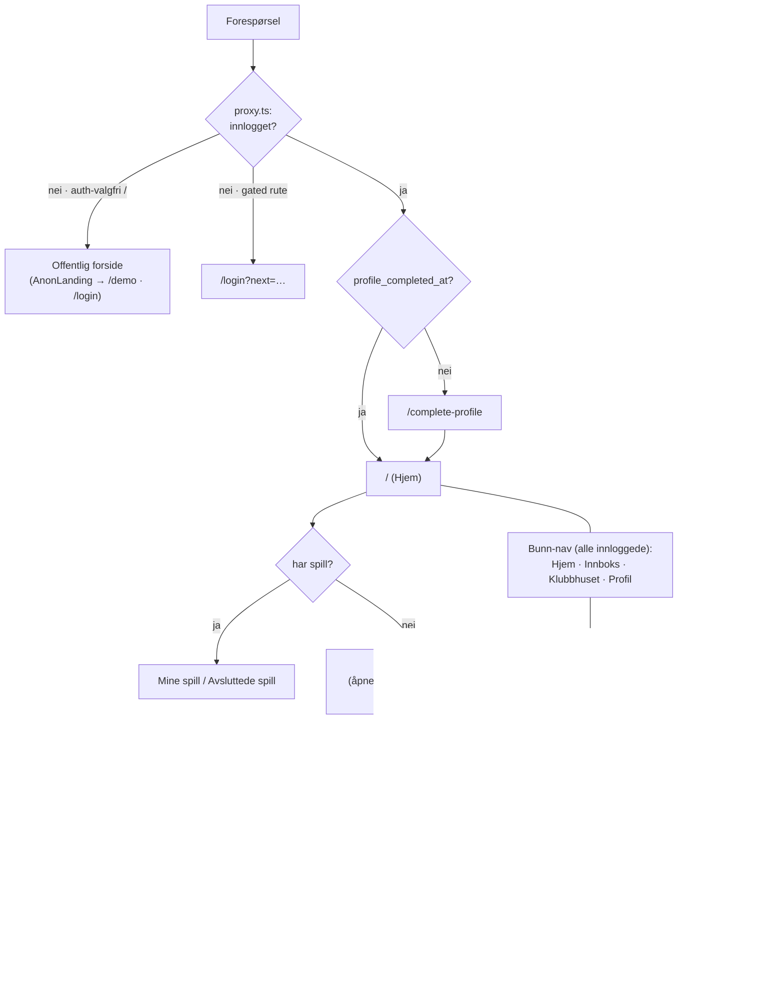
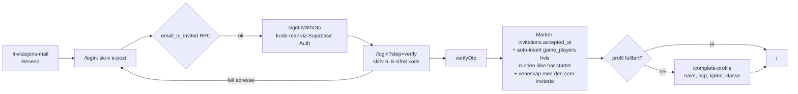
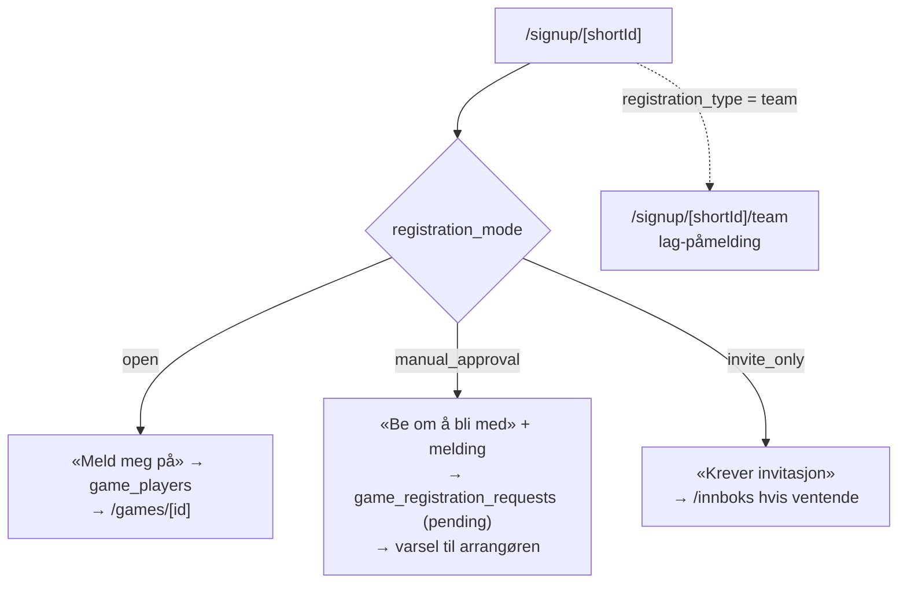
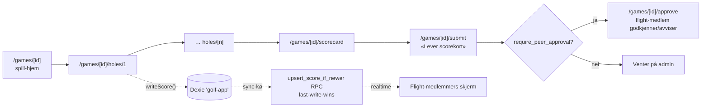
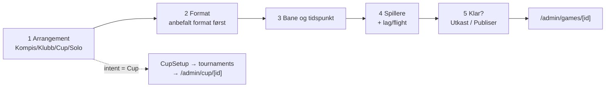
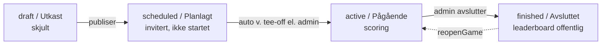

<!--
  Brukerflyt-kart for Tørny. Levende dokument — brukes til å vurdere brukervennlighet.
  Kartlagt 2026-05-31 via fem parallelle kode-utforskninger (auth, gameplay, admin,
  wizard, navigasjon). Alle ruter/actions verifisert mot faktisk kode.
-->

# Tørny — brukerflyt-kart

Mobil-først PWA. To personas: **Admin/arrangør** (`is_admin`) og **Spiller** (invitert).

Diagrammene under er Mermaid (renderes på GitHub / i preview). Lenger ned:
teknisk-kobling per steg, og en prioritert brukervennlighets-vurdering.

---

## 0. Inngang & routing

`proxy.ts` gater alt unntatt `/login`, `/legal/*`, `/signup/*`, og PWA-assets.
Uinnlogget → `/login?next=<path>`. Innlogget uten fullført profil → `/complete-profile`.
**Unntak — auth-valgfrie ruter** (#1185, #1264, #1265): `/`, `/finn-turneringer` og
`/spillformater/*` redirecter IKKE anonyme. `/` rendrer den offentlige forsiden
(`AnonLanding`) som forteller hva Tørny er og lenker til /demo + /login; innloggede
får sitt personlige Hjem uendret (proxyen beholder verified-user-headeren, så bunn-nav-en
består).

```mermaid
flowchart TD
  Req[Forespørsel] --> P{proxy.ts:<br/>innlogget?}
  P -- "nei · auth-valgfri /" --> Anon["Offentlig forside<br/>(AnonLanding → /demo · /login)"]
  P -- "nei · gated rute" --> L["/login?next=…"]
  P -- ja --> Prof{profile_completed_at?}
  Prof -- nei --> CP["/complete-profile"]
  Prof -- ja --> Home["/ (Hjem)"]
  CP --> Home
  Home --> PH{har spill?}
  PH -- ja --> List["Mine spill / Avsluttede spill"]
  PH -- nei --> Disc["Finn turneringer<br/>(åpne spill + dine klubbers spill)"]
  Nav["Bunn-nav (alle innloggede):<br/>Hjem · Innboks · Klubbhuset · Profil"]
  Home --- Nav
  Nav --> Klub["Klubbhuset → /admin"]
  Klub --> KP{is_admin?}
  KP -- ja --> Sek["Hele Sekretariatet<br/>(Spill, Spillere, Baner, Cup, Formater, …)"]
  KP -- nei --> PlayerKlub["Adaptivt spiller-rom (#892):<br/>invitasjon til å arrangere<br/>+ Dine klubber + Det du arrangerer<br/>+ Verktøy (Baner, Spillformater)"]
```

**Persistente nav-elementer** (verifisert i `app/[locale]/layout.tsx` + sidene):
`BrandMark` (logo, ikke klikkbar) · `InstallBanner` (PWA) · `ProductUpdateBanner` ·
`TopBar` (tilbake-pil + tittel, på indre sider) · `AppVersionFooter` (versjon + Personvern).

**Vedvarende bunn-nav** (#355, #392): fire faste faner — Hjem, Innboks, Klubbhuset, Profil —
rendret globalt i `app/[locale]/layout.tsx`, synlig for alle innloggede på alle flater (også i Klubbhus-
rommet `/admin`). Skjult når du er utlogget, på `/login` og `/complete-profile`, i veiviseren
(`/opprett-spill`, `/admin/games/new`) og på hullskjermen (`BottomNav`, `hidden`). I tillegg skjules den
i redigeringsveiviseren på `/admin/games/[id]/edit`, der av CSS-regelen for `data-hides-bottom-nav` i
`app/globals.css`. Fanenes forsider (Klubbhuset, Innboks, Profil) har ingen tilbakepil. Sider du åpner
fra Klubbhuset (Baner, Spillformater, en klubb), går tilbake dit: lenkene bærer `?kilde=klubbhuset`
(#2487), og kvitteringen for ny bane sier «Tilbake til Klubbhuset». «Klubbhuset» er universell:
fanen gates ikke på rolle, men flatene inne gates — admin ser hele Sekretariatet, mens spilleren
møter et **adaptivt rom** (#892): en invitasjon til å arrangere (aldri en blindvei), klubbene sine,
spillene/cupene de selv har satt opp, og Verktøy (Baner + Spillformater) nederst. **Opprett
spill/bane bor inne i Klubbhuset, ikke på Hjem.** Hjem er play + discover-navet: dine spill +
«Finn turneringer». **Finn turneringer er terminlista** (#2258): én liste sortert på starttid og delt i
dager («Lørdag 4. oktober · om 3 dager»), med filterbrikkene «Alle», «Denne helga» og «Klubben min»
(`?vis=`), plass-linja der runden har tak og «Fullt» uten knapp når den er full. Hjem og forsiden viser
de samme dagene og radene.

**Klubber** (#442 + #50, milepæl Klubb-skala): en klubb er en navngitt, styrt container folk og
turneringer kan høre til. **Opprettelse er admin-gated** (#50): vanlige brukere oppretter ikke
klubber — `/klubber` viser en kontakt-vei (klubb@tornygolf.no), og hoved-admin oppretter klubben fra
Sekretariatet (`/admin/klubber/ny`, `admin_create_club`-RPC), velger eier (som blir **eneeier**) og
setter avtale-rammer: et **medlemstak** (`member_cap`) og en **varighet** (`valid_until` — uendelig
eller en sluttdato, redigerbar i `/admin/klubber/[id]`). Klubbene dine bor under Klubbhuset
(`/klubber`); klubb-siden (`/klubber/[id]`) viser medlemmer, lar eier/admin legge til på e-post eller
dele en bli-med-lenke (`/klubber/bli-med/[shortId]` → forespørsel → eier godkjenner), og har en «Sett
opp en runde for klubben»-dør. **Eieren delegerer** (#50): via `/klubber/[id]/rolle/[userId]` gjør
eieren medlemmer til admin eller eier (flere likestilte), eller setter dem ned (`set_club_member_role`
— siste eier kan ikke degraderes; den berørte varsles). Når et spill opprettes for en klubb
(«Klubb-turnering» i veiviseren, `games.group_id`), ser **alle klubbens medlemmer** runden i «Finn
turneringer» og melder seg på direkte, uansett påmeldingsmåte, også `invite_only`. Medlemskap ER
invitasjonen. Derfor kan en klubb-turnering publiseres uten spillere, med tomt steg 4 og tom liste også i
«Rediger spill», unntatt med påmeldingstype «Lag» (#2433).
**Klubben velges først** (#2439): «Klubb-turnering» spør om klubben øverst på steg 2,
over formatlista. Har du bare én gyldig klubb, er den valgt fra start, og «Neste» og «Publiser» krever
en klubb. Kortet «Klubb-turnering» vises bare for den som er med i en klubb som ikke er utløpt.
**Medlemstak + utløp håndheves** (#50): en full klubb tar ikke imot flere medlemmer; når `valid_until`
passeres fryses klubben (borte fra discovery, ingen nye medlemmer/spill, «utløpt»-banner), men pågående
runder spilles ferdig og en eier kan fornye via admin. Klubb ≠ venner: venner er en egen, flat relasjon.

**Venner** (#369, milepæl Klubb-skala): en flat, gjensidig bruker↔bruker-relasjon — ingen eier, ingen
admin, ingen identitet (≠ klubb). Du legger til venner på `/profile/venner` på tre måter: folk du har spilt
med (forslag), e-post (ukjent adresse → tilbud om å invitere på samme e-post), eller en delbar lenke
(`/venner/legg-til/[friend_code]`) som kobler den som åpner den direkte. Vennskap er gjensidig (forespørsel
→ mottaker godtar i Innboks); `friend_request`/`friend_accepted`-varsler dyplenker til vennelista. Venner
blir søkbare i lag-påmelding (`getTeamCandidates` = venner ∪ co-players, #408), og venners
`open`/`manual_approval`-spill (aldri `invite_only`) står i «Finn turneringer» med venne-linja («Jonas og
Marte er med»).
**Åpen for venner:** på et `manual_approval`-spill kan arrangøren huke av «Slipp venner direkte inn»
(`games.let_friends_skip_gate`), og da melder venner seg på direkte forbi godkjennings-gaten mens
ikke-venner fortsatt ber om plass.

---

## 1. SPILLER-flyter

### P1 — Bli med (invitasjon → innlogging → profil)

```mermaid
flowchart LR
  A[Invitasjons-mail<br/>Resend] --> B["/login: skriv e-post"]
  B --> C{email_is_invited RPC}
  C -- ok --> D[signInWithOtp<br/>kode-mail via Supabase Auth]
  D --> E["/login?step=verify<br/>skriv 6–8-sifret kode"]
  E -- feil adresse --> B
  E --> F[verifyOtp]
  F --> G[Marker invitations.accepted_at<br/>+ auto-insert game_players hvis<br/>runden ikke har startet<br/>+ vennskap med den som inviterte]
  G --> H{profil fullført?}
  H -- nei --> CP["/complete-profile<br/>navn, hcp, kjønn, klasse"]
  H -- ja --> Home["/"]
  CP --> Home
```

| Steg | Rute / fil | Teknisk |
|---|---|---|
| Be om kode | `app/[locale]/(auth)/login/page.tsx`, `actions.ts` → `sendCode` | `email_is_invited` RPC gater `shouldCreateUser`; `signInWithOtp`. Kode-mail via **Supabase Auth**. Honeypot-felt `website`. Med gyldig `?invite=` står invitasjonskortet (`components/games/InvitationCard.tsx`, #2266) over skjemaet «Bli med på runden», uten demo-lenke og passkey-knapp. |
| Verifiser | `verifyCode` | `verifyOtp({type:'email'})`. Marker `invitations.accepted_at` (RLS 0012). Spill-invitasjon gir plass bare før start (`isRosterLocked`, #2212): planlagt runde → auto-insert i `game_players` + `notifyInvitedToGame` (er spillet et utkast, gir invitasjonen plass på lista, men varselet kommer først når spillet publiseres, #2445); startet eller ferdig runde → ingen plass, invitéen lander på `/complete-profile?invite_notice=game_started` med en beskjed (gjest som allerede står på lista, #1009, lander på runden). Alle invitasjoner, også de uten spill, gir vennskap med den som inviterte (`befriend_inviter`, #481/#2212). |
| Endre adresse | `_components/VerifyCodeForm.tsx` → `changeEmailHref` | Retur-kant til steg 1 (#1346): GET til `/login` med `email`, `next` og `invite` beholdt, så feltet prefylles og invitasjonskortet (#1169, #2266) overlever. Utveien når adressen er feiltastet — «Send ny kode» treffer bare samme feil adresse. |
| Fullfør profil | `app/[locale]/complete-profile/page.tsx`, `actions.ts` | Setter `users.profile_completed_at` + navn/nickname/`hcp_index`/gender/level. |

**To mailer per invitasjon:** Resend-notifikasjon (`lib/mail/inviteNotification.ts`) når noen inviterer, så kode-mail når invitéen ber om kode på `/login`.

### P2 — Selv-påmelding (offentlig lenke)

`/signup/[shortId]` (offentlig). Tre moduser styrt av `games.registration_mode`:

```mermaid
flowchart TD
  S["/signup/[shortId]"] --> M{registration_mode}
  M -- open --> O["«Meld meg på» → game_players<br/>→ /games/[id]"]
  M -- manual_approval --> R["«Be om å bli med» + melding<br/>→ game_registration_requests (pending)<br/>→ varsel til arrangøren"]
  M -- invite_only --> I["«Krever invitasjon»<br/>→ /innboks hvis ventende"]
  S -. "registration_type = team" .-> T["/signup/[shortId]/team<br/>lag-påmelding"]
```

Lag-flyt (`/signup/[shortId]/team`): kaptein navngir lag + fyller medspiller-slots (kjent bruker oppslag eller ukjent e-post). Kjente → in-app-varsel + auto-`game_players`. Ukjente → Resend-invitasjon (`lib/mail/teamInvitation.ts`) → OTP → profil → «Bli med på lag».

### P3 — Spille en runde

```mermaid
flowchart LR
  GH["/games/[id]<br/>spill-hjem"] --> H1["/games/[id]/holes/1"]
  H1 --> Hn["… holes/[n]"]
  Hn --> SC["/games/[id]/scorecard"]
  SC --> SUB["/games/[id]/submit<br/>«Lever scorekort»"]
  SUB --> AP{require_peer_approval?}
  AP -- ja --> APR["/games/[id]/approve<br/>flight-medlem godkjenner/avviser"]
  AP -- nei --> Done[Venter på admin]
  H1 -. "writeScore()" .-> DX[(Dexie 'golf-app')]
  DX -. "sync-kø" .-> RPC["upsert_score_if_newer RPC<br/>last-write-wins"]
  RPC -. "realtime" .-> Flight[Flight-medlemmers skjerm]
```

| Steg | Rute / fil | Teknisk |
|---|---|---|
| Spill-hjem | `app/[locale]/games/[id]/(home)/page.tsx` | Auto-start: `scheduled→active` når tee-off passert (`startScheduledGame` + `after(revalidateTag)`). CTA: «Start runden» → «Fortsett» → «Gjennomgå og lever». Er ditt eget kort levert og du har ført kort i flighten som ikke er levert, viser siden «Lever kortene du har ført (N)» til lever-siden (#2200). Cachet `getGameWithPlayers` (tag `game-${id}`). |
| Taste slag | `app/[locale]/games/[id]/holes/[holeNumber]/page.tsx` + `HoleClient.tsx` | Alle formater unntatt Bingo Bango Bongo taster på scoreskinna nederst (`ScoreRail` + `useScoreRail`, #2251): ett trykk setter scoren og går videre til neste spiller uten score. Appen har den samme skinna (`native/app/src/screens/Hole.tsx`, #2252). `writeScore()` → Dexie → sync-kø → `upsert_score_if_newer` RPC. Sync-worker drainer på online/focus/30s + service worker bakgrunns-sync. Realtime-merge per flight. RLS: eget + samme-flight under `active`. |
| Gjennomgå | `app/[locale]/games/[id]/scorecard/page.tsx` | `resolveScorecardLayout` (solo 1 kolonne / lag fler-kolonne). Netto skjult under `reveal`-aktiv. I appen (`native/app/src/screens/Scorecard.tsx`) er kortet klassisk: UT og INN med POENG eller NETTO (`lib/scorecard/scorecardGrid.ts`), og etter levering et stempel med tidspunkt, hvem som signerte og hvem som godkjente (`lib/scorecard/scorecardStamp.ts`, #2262). |
| Lever | `app/[locale]/games/[id]/submit/page.tsx` + `actions.ts` → `submitScorecard` | Setter `game_players.submitted_at`. Idempotent (`.is('submitted_at', null)`). Lever-siden tilbyr også kortene til dem i flighten du har ført alle hullene for, og gjestekort som er fullt ført, siden en gjest aldri kan logge inn: «Lever 3 kort ✓» leverer dem sammen med ditt eget (skjemafeltet `alsoFor` → `submitScorecardCore`, #2200). Regelen bor i `lib/games/flightDelivery.ts`, lesingen i `lib/games/loadFlightDelivery.ts`, appen sender dem i `alsoFor` til `POST /api/games/[id]/submit-team`, og hvem som leverte, står i `submitted_by_user_id` (0191). Varsler peers + admin (`scorecardSubmittedNotification` Resend kun til off-app-admin). Påminnelsen: et kvarter etter siste hull får den som kan levere kortet, ett `deliver_reminder` (sveipen `POST /api/cron/delivery-reminder`, pg_cron fra 0192; regelen i `lib/games/deliveryReminderSweep.ts`). Spillsiden sender den ikke lenger. |
| Godkjenn (peer) | `app/[locale]/games/[id]/approve/page.tsx` + `actions.ts` | `approveScorecard` / `rejectScorecard(reason)` (avvis nullstiller `submitted_at` for re-levering; i formatene med felles ball åpner avvisningen hele laget, #2213). Kortet leser eierens rader per hull, samme regel som lever-siden (#1577). Den som leverte et kort for en annen, kan ikke godkjenne det; en annen i flighten eller arrangøren gjør det (`guard_game_players_self_update`, 0191, #2200). |

### P4 — Leaderboard

`app/[locale]/games/[id]/leaderboard/page.tsx` — mode-router (Stableford/Best ball/Wolf/Skins/Nassau/Matchplay/…). Live under `active` (med reveal-/front-nine-gating), full + podium etter `finished`. Oppdaterer seg selv via realtime (`LeaderboardRealtime` i `LeaderboardShell`, #679). Eksport: `app/[locale]/games/[id]/leaderboard/export/route.ts`.

**Tavla (#2253):** live solo stableford (også modifisert) og solo slagspill vises som en tavle: skoggrønt hode, mørk tavle med skilt i fire kolonner (plass, spiller, hull, poeng/netto), pil for plassendring siden forrige hull, fem prikker for de siste hullene og din egen rad merket «DU». Tavla viser topp 5 til du trykker «Vis alle», og du trykker på et skilt for å gi reaksjoner. Stripen «Din runde» nederst viser plassen din og knappen videre («Hull N →» eller «Lever scorekort →»); den vises ikke for arrangør som ikke spiller, trukket spiller eller på spectate/embed. Utregningen bor i `lib/leaderboard/liveBoard.ts`. Nye solo slagspill rangeres etter netto mot par over hullene hver spiller har spilt (`mode_config.ranking = 'net_to_par'`, stemplet ved opprettelse); eldre spill og ligarunder beholder netto slag. Lagstableford, reveal-spill og ferdige spill (pall eller duell) har egen visning.

### P5 — Profil, historikk & konto

| Flyt | Rute | Teknisk |
|---|---|---|
| Rediger profil | `app/[locale]/profile/page.tsx` + `actions.ts` | navn, nickname, `hcp_index`, gender, level. `handicap_updated_at` stemples ved lagring. |
| Inviter venn | inline på `/profile` (`app/[locale]/invite/actions.ts`) | `sendFriendInvite` — kvote + rate-limit, `invitations` (game_id null) + Resend. |
| Venner | `/profile/venner` + `actions.ts` (#369) | Legg til (forslag/e-post/lenke), godta/avslå, fjern. RPCer `send_friend_request`/`*_by_email`/`respond_friend_request`/`remove_friend`/`connect_via_friend_code`; `getFriendData` for siden. Delt lenke landes på `/venner/legg-til/[code]`. |
| Historikk / statistikk | `/profile/historikk`, `/profile/statistikk` | |
| GDPR-eksport | `app/[locale]/profile/export/route.ts` | Last ned egne data. |
| Slett konto | `app/[locale]/profile/slett-konto/page.tsx` + `actions.ts` | **Dedikert bekreftelses-side**. Blokkeres hvis eneste arrangør av noe uavsluttet (spill, cup, liga) — deltakere slipper alltid gjennom og trekkes automatisk (`anonymize_user`, 0174). `admin.deleteUser`. |
| Varsler | `app/[locale]/innboks/page.tsx` (#2263) | Innboks-fanen i bunnmenyen. En oppslagstavle: «Krever handling» (uleste varsler som ber deg gjøre noe, med en knapp), så «I dag» og «Tidligere». Leverte kort, godkjenninger og påmeldinger i åpne spill samles per spill på én rad. Filterbrikker: Alle, Krever handling, Venner. En påmelding som venter på svar har «Godta»/«Avslå» rett i innboksen (arrangøren av spillet eller admin, samme kjerne som påmeldingssiden, `lib/games/registrationDecisionCore.ts`, #2440). Reglene bor i `lib/notifications/inboxSections.ts`. Et trykk markerer lest; saker som er avgjort andre steder, vises som lest neste gang. Månedsbrev-bryteren står på Profil under «App». |

---

## 2. ADMIN / ARRANGØR-flyter

### A1 — Opprett spill (GameWizard, 5 steg)

Inngang: via Klubbhuset (#392) — admin går Spill-flaten → `/admin/games/new`; vanlig spiller går Spill-flaten → `/opprett-spill`. Samme `GameWizard`-komponent, steg via `?step=1..5` + klient-state (ikke rute-per-steg). Steg 4 har en andre skjerm for lag, sider og flights (`?step=4&skjerm=lag`, #2321).

```mermaid
flowchart LR
  S1["1 Arrangement<br/>Kompis/Klubb/Cup/Solo"] --> S2["2 Format<br/>anbefalt format først"]
  S2 --> S3["3 Bane og tidspunkt"]
  S3 --> S4["4 Spillere<br/>+ lag/flight"]
  S4 --> S5["5 Klar?<br/>Utkast / Publiser"]
  S5 --> G["/admin/games/[id]"]
  S1 -. "intent = Cup" .-> CUP["CupSetup → tournaments<br/>→ /admin/cup/[id]"]
```

| Steg | Komponent | Teknisk |
|---|---|---|
| 1 Arrangement | `IntentSelector` | Intent styrer format-katalog (`getFormatsForIntent`). «Klubb»-kortet vises bare for den som er med i en gyldig klubb (#2439). |
| 2 Format | `FormatGrid` (eller `CupSetup`) | **DB-drevet** fra `formats` + `format_intent_mapping`, anbefalt format først: med antall (Kompis) er det første formatet som passer, et stort kort, og tre til står under (#2260). Cup → `createTournamentDraft` → `tournaments`-rad → `/admin/cup/[id]`. Ved «Klubb-turnering» velges klubben (`ClubPicker`) over formatlista, og «Neste» krever en gyldig klubb (#2439). |
| 3 Bane og tidspunkt | `BasicsSection` | Bane + tee-boks (fra `getNewGameFormData`), tee-off (Oslo-tz), auto-navn. |
| 4 Spillere | `PlayerPickerGrid` + `PlayerTray`, så `TeamsAssignmentSection` | Vennene (eller klubbmedlemmene) som kort, du selv først og så sist spilt først (`orderPickerPlayers`, #2321). Brettet nederst teller mot målet («3 av 4 · én til»). Lagformater og singles matchplay fordeler lag, sider og flights på en egen skjerm («Neste: lagene»); solo-formatene har tee per spiller på velgeren. Gjest legges til fra «+ Gjest»; «✉ E-post» samler adresser som inviteres når spillet publiseres (`sendPublishInvites`). Steget kan stå tomt hvis selv-påmelding velges på steg 5, og i en klubb-turnering med individuell påmelding (#2433). |
| 5 Klar? | `ReadyStep` | Et lite invitasjonskort med spillnavnet som felt midt i kortet, og en sjekkliste (Bane, Format, Tee-off, Spillere) med status og «Endre» som hopper til steget valget bor på (#2282). Under lista: «Hvem kan melde seg på?» (ikke i en klubb-turnering, der medlemskapet er invitasjonen) og «Vis avanserte innstillinger». Brettet nederst: «Publiser og del invitasjonen» (`createAndPublishGame`, status `scheduled` + invitasjoner) eller «Lagre som utkast» (`createGameDraft`, status `draft`). Publisering varsler alle på lista én gang (`notifyRosterInvites`); en tom klubb-turnering varsler ingen. «Lagre som utkast» varsler ingen (#2445). En venn uten fullført profil stopper ikke publiseringen. Runden starter når profilen er på plass, og spillerraden på steg 5 sier «N venter på profil» (#2441). |

### A2 — Administrer spill

`/admin/games` (liste, filtrer status) → `/admin/games/[id]` (detalj). Inline handlinger etter status:
- **Start** (`startGame` / `startScheduledGameAction`): fryser course-handicap, `→ active`. Starten venter til alle på lista har fullført profilen. «Styr spillere» og spillsiden viser hvem som venter (#2441).
- **Inviter** (`InviteToGameSection`): legg til eksisterende spiller eller inviter på e-post (Resend, spill-scoped).
- **Påmeldinger** (`/admin/games/[id]/signups`): godkjenn/avvis manuelle forespørsler. Arrangøren av spillet slipper også inn, fra varselet eller fra «Påmeldinger» på `/games/[id]/spillere` (#2440).
- **Godkjenn/Åpne scorekort**: `adminApproveScorecard`, `reopenScorecard` (åpner hele laget i formatene med felles ball, #2213). Statussiden (`/admin/games/[id]/status`) og spillersiden (`/games/[id]/spillere`) viser «Levert av {navn}» på et kort en annen leverte (#2200); gjenåpning virker som før.
- **Avslutt** (`endGame`): krever alle levert (+ godkjent hvis peer). En gjest kan ikke levere selv, men den som fører kortet, leverer det (#2200), så gjester trenger ikke lenger «Avslutt likevel». Side-turnering → `/admin/games/[id]/avslutt` (velg LD/CTP-vinnere). `→ finished` + `gameFinishedNotification` (Resend, off-app). `reopenGame` reverserer; kortene står fortsatt som levert, admin åpner dem som skal rettes (#2213).
- **Rediger** (`/admin/games/[id]/edit`), **Slett** (`/admin/games/[id]/slett`, **dedikert side**, status-bevisst advarsel).

### A3 — Baner, spillere, cup, formater

| Område | Ruter | Notat |
|---|---|---|
| Baner | `/admin/courses` (+ `/new`, `/[id]/edit`) | Hull/par/SI/tee-bokser. Tee soft-arkiveres hvis i bruk. **Sletting er inline (ingen confirm-side)** — avvik. |
| Spillere | `/admin/spillere` (+ `/[id]`, `/[id]/slett`) | Inviter (`sendInvitation` + Resend), resend, **trekk tilbake** (`/invitations/[id]/trekk-tilbake`), rediger, slett (**dedikert side**). |
| Cup | `/admin/cup` (+ `/[id]`, `/generer`, `/slett`, `/trekk/[userId]`) | Fler-match-turnering; matcher legges til via wizard cup-link. **Trekk underveis** (#1814, **dedikert side**): flagger spillerens ikke-startede kamper, som halveres (≥ 30 min før tee-off) eller går som walkover til motstanderlaget. Samme side angrer trekket. Spilleren selv går via `/cup/[id]/trekk`. |
| Formater | `/admin/formats` | Styr format-katalogen som driver wizard-grid-en. |
| Lanseringer | `/admin/lanseringer` | Produkt-oppdaterings-digest. |

### A4 — Klubbhuset / Sekretariatet (dashboard)

`/admin` (`AdminShell`) — nådd via den universelle «Klubbhuset»-bunn-nav-fanen (#392). Fanens forside har ingen tilbakepil (#2487). For admin: hilsen + fire rader i full bredde (`DenseTileList`: Spill / Spillere / Baner / Resultatprotokoll, og «Innsendte ideer» som femte når det ligger usette ideer) + «Mer i Sekretariatet» som et tokolonners rutenett av kompakte kort (`CompactTileGrid`: Cuper / Ligaer / Lanseringer / Klubber / Formats / Spillformater, og «Innsendte ideer» som sjuende når køen er tom) + aktivitets-logg (siste 14 dager). For vanlig spiller: et **adaptivt rom** (#892, `PlayerKlubbhus.tsx`) som varierer på to fakta — har du klubber, og har du opprettet noe spill/cup. Seksjoner i rekkefølge: hilsen (umiddelbar) → arrangement-blokk (invitasjon «Sett opp en runde» / «… eller en cup» når 0 opprettet, ellers «Det du arrangerer» med «+ Ny runde» + capped liste) og raden «Cuper» med «Du er med i n» når du er med i minst én cup → Dine klubber (inline `getMyClubs`-liste, ellers «Ikke med i en klubb ennå →») → Verktøy (Baner, Spillformater og «Har du en idé?»). Lista i «Det du arrangerer» (og «Se alle» på `/klubbhuset`) tar ikke med cupkamper og ligaflighter; de hører til cupens og ligaens side (`onlyStandaloneGames`, #2489). Baner, Spillformater og klubbradene bærer `?kilde=klubbhuset`, så tilbake fra dem går til `/admin`. Arrangement + klubber strømmer bak hver sin Suspense; ingen admin-tellinger eller aktivitets-logg.

---

## 3. Status-livssyklus

```mermaid
flowchart LR
  D[draft / Utkast<br/>skjult] -->|publiser| S[scheduled / Planlagt<br/>invitert, ikke startet]
  S -->|auto v. tee-off el. admin| A[active / Pågående<br/>scoring]
  A -->|admin avslutter| F[finished / Avsluttet<br/>leaderboard offentlig]
  F -.->|reopenGame| A
```

Et utkast ser bare arrangøren (og admin). Spillerne på lista ser det, og får varsel, først når det publiseres (#2445).

---

## 4. Brukervennlighets-vurdering

Sluttbruker har **null programmeringserfaring**, tester på **iPhone Safari/PWA**. Sortert etter effekt.

### Det som funker bra (behold)
- **Én Opprett-dør** med rolle-routing (#346) — admin→`/admin/games/new`, spiller→`/opprett-spill`.
- **Dedikerte `/slett`-sider** for spill og spillere, med status-bevisste advarsler.
- **Offline-først** med synlig `SyncBanner`; auto-start så planlagte spill bare starter.
- **GDPR**: selv-eksport + selv-sletting med aktivt-spill-guard.
- **Honeypot + rate-limit** på alle skjema; tydelige status-labels.

### Funn (prioritert)

| # | Funn | Alvor | Hvorfor / hva å vurdere |
|---|---|---|---|
| 1 | **Ingen bunn-nav / meny.** Hjem er eneste nav. Bytte spill, nå profil/innboks/leaderboard = via hjem + tilbake. | Høy | I PWA uten nettleser-chrome føles dette som blindvei. Vurder en enkel bunn-tab (Hjem / Innboks / Profil) eller en vedvarende «hjem»-snarvei. |
| 2 | **Onboarding hopper: OTP → auto-innmeldt i spill → `/complete-profile` → hjem.** Ingen «fortsett til spillet ditt». | Høy | Ny spiller havner på et profilskjema uten kontekst, og må selv finne spillet under «Mine spill». Vurder å sende rett til spillet etter profil, eller vis tydelig «Du er meldt på X». |
| 3 | **«Funn turneringer» vises kun i tom-tilstand.** Har spilleren ≥1 spill, finnes ingen vei til å oppdage/melde seg på nye åpne spill fra hjem. | Middels | Gi en vedvarende «Finn turneringer»-inngang uavhengig av om man har spill. |
| 4 | **Leaderboard er ikke realtime.** Må refreshe for å se nye tall. | Middels | For «følg runden live» er dette skuffende. Vurder lett poll/refresh på leaderboard-siden. |
| 5 | **Offline last-write-wins overskriver stille.** To som taster samme hull → eldste forsvinner uten varsel. | Middels | `SyncBanner` viser kø-status, men ikke konflikt. Vurder per-slag «lagret/synket»-merke + konflikt-hint. |
| 6 | **Peer-godkjenning kan låse flighten.** Forsvinner en peer, henger kortet til admin overstyrer. | Middels | Vurder timeout/auto-eskalering til admin, eller gjør peer-godkjenning valgfritt-default-av. |
| 7 | **Selv-påmelding/utløpt invitasjon gir kryptiske feil.** «user_not_found» når selv-reg er av; utløpt invitasjon = samme uklare feil. | Middels | Egne, vennlige meldinger: «Invitasjonen er utløpt — be arrangøren sende ny». |
| 8 | **Lag-påmelding: langt skjema, ingen inline-validering, oppslag uten autocomplete; «Bli med på lag» forklarer ikke hva som skjer.** | Middels | Valider per felt; vis hva som skjer ved innmelding; autocomplete på kjente spillere. |
| 9 | **Trusted-creator-redirect bouncer:** suksess → `/admin/games/[id]` → auto-bounce til `/`. (Kjent «rough edge» i koden.) | Lav→middels | Send trusted creator rett til `/games/[id]` eller en egen kvittering. |
| 10 | **Bane-sletting er inline uten confirm-side**, mens spill/spiller har dedikert side. Bane-sletting cascader hull + tees. | Lav | Konsistens: gi bane-sletting samme `/slett`-mønster. |
| 11 | **Ingen aktiv-spill-nudge.** Pågår en runde, er det bare ett kort blant flere. | Lav | Løft aktivt spill visuelt øverst på hjem. |
| 12 | **Utløpt/slettet invitasjons-lenke → 404** uten vennlig fallback. | Lav | Egen «denne lenken gjelder ikke lenger»-side med vei videre. |

### Foreslåtte neste steg
1. **#1 + #2** har størst daglig effekt — naviger + onboarding-landing. Verdt en egen brainstorm.
2. Gjør #3/#4/#11 til konkrete issues (alle små, høy synlighet).
3. #7/#12 (vennlige feilmeldinger) er rask copy-gevinst — passer `humanizer`/`no-nb`-disiplinen.

> Hvil-merknad: jeg kan gjøre hvert funn om til et GitHub-issue med spec, eller vi kan ta #1/#2 i en `superpowers:brainstorming`-økt før noe kode.
